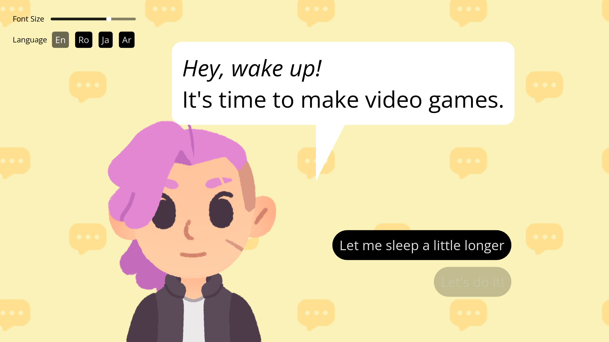
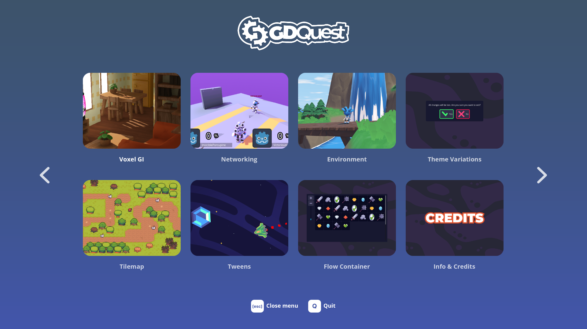
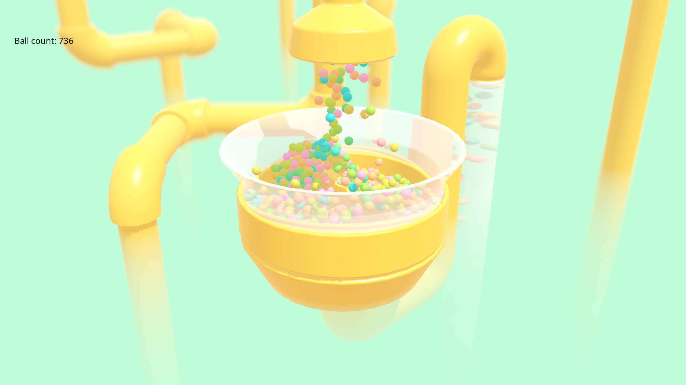
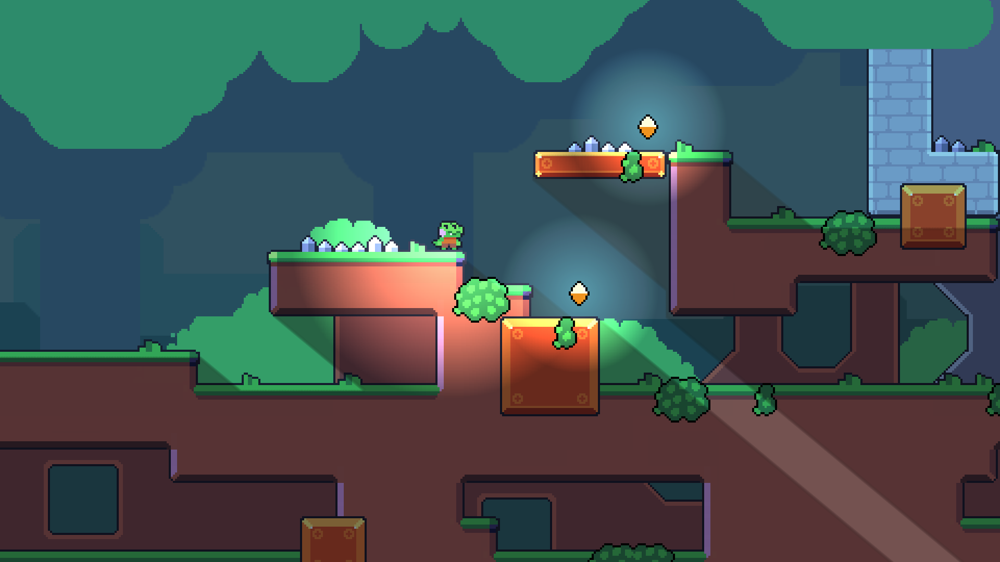
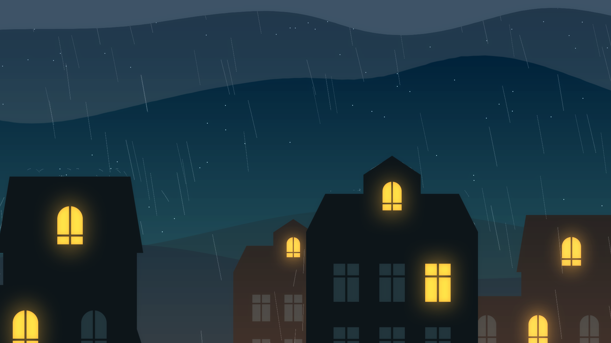
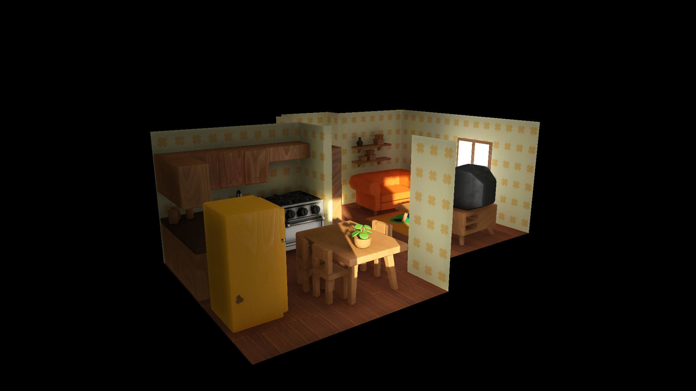
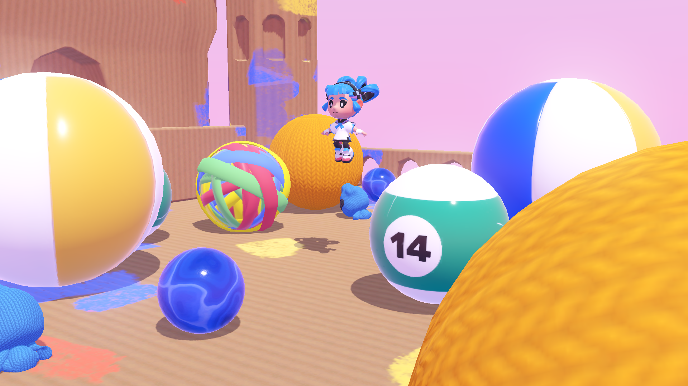

# Godot 4.0: New Features demos

It's here!

After a very long wait (even by Godot standards!), we finally have our hands on Godot 4.

In this project, we've built upwards of 23 demos, trying to demonstrate in the simplest way we could manage some of the most awaited features of Godot 4.0

Feel free to run the project and test them out!

## A Few Things of Note

Additionally to the demos you can run from the menu, we have some examples accessible only in the editor.

- in [additional/custom_resources](additional/custom_resources), you'll find a demonstration of custom resource exports, grouped exports, auto-generation documentation, and generally, the new inspector panel and export features
- in [additional/POT_generation](additional/POT_generation), we explain how to generate POT (translation) files
- in [additional/snippets](additional/snippets), you'll find a good number of examples of the new GDScript features and syntax
- in [2d_particles](2d_particles), there's an additional rainy scene
- in [networking](networking), you'll find no less than six different network architectures, which we tried to keep as simple as possible, demonstrating different setups.

## Demos

- [2d Clipping](./2d_clipping)
- [2d Dynamic Lights](./2d_dynamic_lights)
- [2d Lighting](./2d_lighting_normal_map)
- [2d Particles](./2d_particles)
- [2d Physics Benchmark](./2d_physics_benchmark)
- [3d Animation Tree Audio](./3d_animation_tree_audio)
- [3d Balls Pool](./3d_balls_pool)
- [3d Particles](./3d_particles)
- [3d Physics Nodes](./3d_physics_nodes)
- [Animation Retargeting](./animation_retargeting)
- [Audio Polyphony](./audio_polyphony)
- [Cutout Character](./cutout_character)
- [Dialogue Tree](./dialogue_tree)
- [Heightmap Physics](./heightmap_physics)
- [Interface](./interface)
- [Interior](interior-./diorama)
- [Navigation](./navigation)
- [Networking](./networking)
- [Environment](./outdoor_environment)
- [Theme Variations](./theme_variations)
- [Tilemap](./tilemap)
- [Tweens](./tweens)
- [Flexbox](./ui_flexbox)

## Credits

We didn't build those demos alone; We were greatly helped by:

- Fales
- Paulloz
- Tokage
- iFire
- Smix8
- Calinou
- Raulsntos

## Controls

Most demos use:

- <kbd>W</kbd><kbd>A</kbd><kbd>S</kbd><kbd>D</kbd>
- <kbd>🖱 Mouse</kbd>
- <kbd>Left Mouse</kbd>
- <kbd>␣ Space</kbd>

Where relevant, we've described the controls.

## License:

All code is MIT-licensed, and assets are CC-By 4.0 [GDQuest](https://www.gdquest.com/).